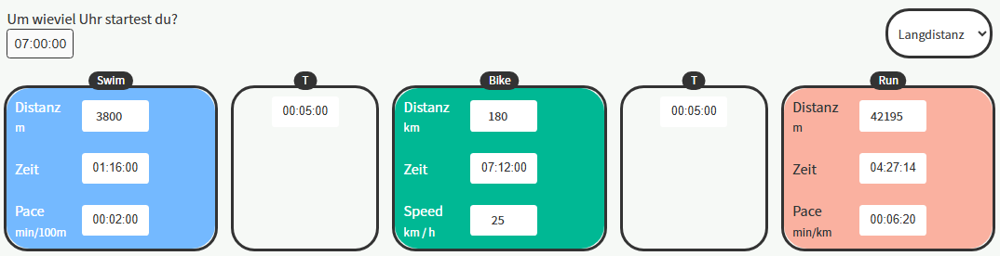

# Pace Rechner Pro

Ein fortschrittlicher Multi-Sport Pace-Kalkulator mit Triathlon-Unterstützung, entwickelt mit Nuxt 3 und Vue 3.

## Screenshot



_The calculator shows the three disciplines (Swimming, Cycling, Running) with T1 and T2 transitions, allowing you to calculate times, paces, and speeds for your triathlon planning._

## ✨ Features

### Multi-Sport Support

- **Schwimmen** - Pace in min/100m
- **Radfahren** - Geschwindigkeit in km/h
- **Laufen** - Pace in min/km
- **Rudern** - Geschwindigkeit in km/h
- **Wandern** - Pace in min/km
- **Gehen** - Pace in min/km

### Triathlon & Duathlon Templates

- **Sprint Triathlon** (750m Schwimmen, 20km Rad, 5km Lauf)
- **Olympic Triathlon** (1.5km Schwimmen, 40km Rad, 10km Lauf)
- **Mitteldistanz** (1.9km Schwimmen, 90km Rad, 21.1km Lauf)
- **Langdistanz** (3.8km Schwimmen, 180km Rad, 42.2km Lauf)
- **Duathlon** (10km Lauf, 40km Rad, 5km Lauf)

### Erweiterte Funktionen

- **Wechselzeiten (T1/T2)** für Triathlons
- **Verlauf** - Speichern und Laden von Berechnungen
- **Einstellungen** - Anpassbare Start-Zeiten, Themen, etc.
- **Zusammenfassung** - Gesamtzeit, Durchschnittsgeschwindigkeit, Zielzeit
- **Split-Zeiten** - Kumulative Zeiten für jede Aktivität
- **Responsive Design** - Optimiert für Desktop und Mobile
- **Tab-Navigation** zwischen Rechner, Verlauf und Einstellungen
- **WordPress Plugin** - Einfache Integration in WordPress Websites

## 🛠️ Tech Stack

- **Nuxt 3** - Vue.js Framework
- **Vue 3** mit Composition API
- **TypeScript** - Type Safety
- **Tailwind CSS** - Utility-First CSS
- **Vite** - Build Tool
- **localStorage** - Persistente Datenspeicherung

## 🚀 Installation & Start

### Prerequisites

- Node.js (Version 16 or higher)
- npm, yarn, or pnpm

### Setup

Dependencies installieren:

```bash
npm install
```

Development Server starten:

```bash
npm run dev
```

Die Anwendung ist dann unter `http://localhost:3000` verfügbar.

### Production Build

```bash
# Generate for WordPress plugin
npm run generate

# Build web version only
npm run build

# Production preview
npm run preview
```

## WordPress Integration

The project includes a ready-to-use WordPress plugin in the `wp-plugin/` folder.

### Installation

1. Build the project: `npm run generate`
2. Copy the `wp-plugin/` folder to your WordPress `plugins/` directory
3. Activate the plugin in the WordPress admin area
4. Use the shortcode `[pace-rechner]` in posts or pages

### Shortcode

```
[pace-rechner]
```

## 📱 Usage

### Rechner Tab

1. **Template wählen** (optional) - Wähle ein vordefiniertes Wettkampfformat
2. **Sportarten hinzufügen** - Klicke auf die Sport-Buttons zum Hinzufügen
3. **Werte eingeben** - Distanz, Zeit oder Pace/Geschwindigkeit
4. **Automatische Berechnung** - Die anderen Werte werden automatisch berechnet
5. **Berechnung speichern** - Klicke auf "Berechnung speichern" in der Zusammenfassung

### Verlauf Tab

- **Gespeicherte Berechnungen** anzeigen
- **Berechnungen laden** - Klicke auf "Laden" um eine Berechnung zu öffnen
- **Berechnungen löschen** - Einzeln oder alle auf einmal

### Einstellungen Tab

- **Standard-Wettkampfformat** festlegen
- **Theme** wählen (Hell/Dunkel/Automatisch)
- **Standard-Startzeit** einstellen
- **Einheiten** konfigurieren (aktuell nur metrisch)

## 🏃‍♂️ Beispiel-Nutzung

### Sprint Triathlon

1. Wähle "Sprint Triathlon" Template
2. Die Distanzen werden automatisch gesetzt:
   - Schwimmen: 750m
   - Radfahren: 20km
   - Laufen: 5km
3. Gib deine Ziel-Zeiten oder Pace-Werte ein
4. Sieh deine Gesamtzeit und Splits in der Zusammenfassung

### Individuelles Training

1. Klicke auf "+ Laufen" um eine Lauf-Aktivität hinzuzufügen
2. Gib Distanz (z.B. 10000m) und Ziel-Pace (z.B. 4:30 min/km) ein
3. Die benötigte Zeit wird automatisch berechnet
4. Speichere die Berechnung für später

## 📂 Projektstruktur

```
├── components/
│   ├── DynamicPaceRechner.vue    # Haupt-Rechner mit Multi-Sport Support
│   ├── MultiSportSummary.vue     # Erweiterte Zusammenfassung
│   ├── HistoryView.vue           # Verlauf der Berechnungen
│   ├── SettingsView.vue          # App-Einstellungen
│   ├── MainNavigation.vue        # Tab-Navigation
│   └── ...                       # Weitere Komponenten
├── composables/
│   ├── useMultiSportCalculations.ts  # Multi-Sport Berechnungslogik
│   ├── useHistory.ts                 # History Management
│   └── useGlobalState.ts             # Globaler State Manager
├── types/
│   └── PaceRechner.ts            # TypeScript Definitionen
├── utils/
│   └── calculations.ts           # Berechnungsfunktionen
├── wp-plugin/                    # WordPress Plugin
└── assets/css/
    └── main.css                  # Globale Styles
```

## 🚧 Geplante Features

- [ ] **Imperial Units** (Meilen, Yards, mph)
- [ ] **Mehrsprachigkeit** (Englisch)
- [ ] **Herzfrequenz-Zonen**
- [ ] **Training-Pläne**
- [ ] **Export/Import** von Berechnungen
- [ ] **Cloud-Synchronisation**

## 🤝 Contributing

Feedback und Beiträge sind willkommen! Erstelle gerne Issues oder Pull Requests.

## 📄 License

MIT License - siehe LICENSE file für Details.

## Author

**Pierre Laub**

- Website: [pierrelaub.de](https://www.pierrelaub.de)

---

_Built for triathletes, by a triathlete_ 🏆
